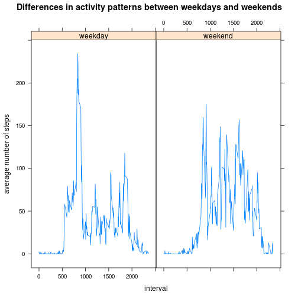

# Reproducible Research: Peer Assessment 1

## Loading and preprocessing the data


```r
activity <- read.csv(unz("activity.zip", "activity.csv"))
activity[["steps"]] <- as.numeric(activity[["steps"]])
activity[["date"]] <- as.Date(activity[["date"]])
activity[["interval"]] <- as.numeric(activity[["interval"]])
```

## What is mean total number of steps taken per day?

Histogram of the total number of steps taken each day:


```r
act_by_day <- aggregate(activity[["steps"]], by=list(activity[["date"]]), FUN=sum, na.rm=TRUE)
hist(act_by_day[["x"]],xlab="number of steps taken each day", main="Total number of steps taken each day")
```

 

Mean total number of steps taken per day:


```r
mean(act_by_day[["x"]])
```

```
## [1] 9354
```

Median total number of steps taken per day:


```r
median(act_by_day[["x"]])
```

```
## [1] 10395
```

## What is the average daily activity pattern?

Average number of steps taken, averaged across all days:


```r
act_by_interval <- aggregate(activity[["steps"]], by=list(activity[["interval"]]), FUN=sum, na.rm=TRUE)
plot.ts(act_by_interval[[1]], act_by_interval[[2]], type="l", xlab="5-minute interval", ylab="average number of steps ", main="Average daily activity pattern")
```

 

5-minute interval, that on average across all the days contains the maximum number of steps:


```r
act_by_interval[which.max(act_by_interval[[2]]),1]
```

```
## [1] 835
```

## Imputing missing values

Total number of missing values in the dataset


```r
sum(is.na(activity))
```

```
## [1] 2304
```

Strategy for filling in all of the missing values in the dataset.
Using the mean for that 5-minute interval.


```r
mean_by_interval <- aggregate(activity[["steps"]], by=list(activity[["interval"]]), FUN=mean, na.rm=TRUE)
```

New dataset with the missing data filled in.


```r
activity_filled <- activity
for (i in 1:nrow(activity)){
  if (is.na(activity[i,1])){
    activity_filled[i,1] <- mean_by_interval[activity_filled[i,3]/5 + 1, 2]
  }
}
```

Histogram of the total number of steps taken each day and Calculate and report the mean and median


```r
act_by_day_filled <- aggregate(activity_filled[["steps"]], by=list(activity_filled[["date"]]), FUN=sum, na.rm=TRUE)
hist(act_by_day_filled[["x"]],xlab="number of steps taken each day", main="Total number of steps taken each day - FILLED NA")
```

 


Mean total number of steps taken per day - FILEED NA:


```r
mean(act_by_day_filled[["x"]])
```

```
## [1] 10282
```

Median total number of steps taken per day - FILLED -NA:


```r
median(act_by_day_filled[["x"]])
```

```
## [1] 10395
```

Mean changes but median not!

## Are there differences in activity patterns between weekdays and weekends?

New factor variable in the dataset with two levels – “weekday” and “weekend” indicating whether a given date is a weekday or weekend day.


```r
activity$day <- as.POSIXlt(activity$date)$wday
activity$weekday <- ifelse(activity$day <= 5 & activity$day > 0, "weekday", "weekend")
activity$weekday <- as.factor(activity$weekday)
```

Panel plot containing a time series plot (i.e. type = "l") of the 5-minute interval (x-axis) and the average number of steps taken, averaged across all weekday days or weekend days (y-axis).


```r
by_interval_weekday <- aggregate(activity$steps, by=list(activity$interval,activity$weekday), FUN=mean, na.rm=TRUE)
library(lattice)
xyplot(by_interval_weekday$x ~ by_interval_weekday$Group.1 | by_interval_weekday$Group.2, type="l", ylab="average number of steps", xlab="interval", main="Differences in activity patterns between weekdays and weekends")
```

 
